# PeerUn — Propuesta de Solución

> **Estudiante:** Cristian  
> **Proyecto:** Aplicación móvil de evaluación entre pares para trabajo colaborativo universitario  
> **Fecha:** 18 de febrero de 2026  
> **Tecnologías definidas:** Flutter · GetX · Roble (auth + DB) · Brightspace (fuente de grupos)

---

## Tabla de Contenidos

1. [Referentes Analizados](#1-referentes-analizados)
2. [Composición y Diseño de la Solución](#2-composición-y-diseño-de-la-solución)
3. [Flujo Funcional Detallado](#3-flujo-funcional-detallado)
4. [Justificación de la Propuesta](#4-justificación-de-la-propuesta)
5. [Capturas de UI — PeerUn](#5-capturas-de-ui--peerun)

---

## 1. Referentes Analizados

### 1.1 Buddycheck

<p align="center">
  
</p>

**Descripción general**

Buddycheck es una herramienta SaaS neerlandesa (Shareworks B.V.) diseñada exclusivamente para la evaluación de la colaboración dentro de equipos universitarios. Su valor diferencial es la integración nativa con cualquier LMS mediante el estándar **LTI (Learning Tools Interoperability)**, lo que permite que los grupos existentes en el LMS se importen automáticamente sin intervención manual.

**Gestión de grupos**

Los grupos no se crean en Buddycheck; se sincronizan directamente desde el LMS (Canvas, Brightspace/D2L, Moodle, Blackboard). Las actualizaciones de composición de equipo se reflejan en la herramienta sin pasos adicionales del profesor.

**Proceso de evaluación**

1. El profesor configura una evaluación: selecciona preguntas, define la ventana de tiempo y decide si los resultados serán visibles para los estudiantes.
2. Los estudiantes reciben un **enlace por correo** para completar la evaluación solo hacia sus compañeros de equipo (no hay autoevaluación por defecto).
3. Tras el cierre, el profesor decide si "libera" los resultados.

**Criterios de evaluación**

El profesor puede usar preguntas predefinidas (tipo Likert) o crear criterios personalizados (escala numérica, texto libre). No impone rúbrica fija.

**Visualización de resultados**

- *Profesor:* puntuación individual, comparación entre grupos, historial de actividades.
- *Estudiante:* puntuaciones recibidas por criterio y promedio general (si la evaluación es pública).

**Limitaciones relevantes**

- No tiene app móvil nativa; funciona a través del navegador del LMS.
- Es de pago; no disponible para estudiantes de Uninorte sin licencia institucional.
- No existe versión en español.

**Capturas de la interfaz de Buddycheck**

| Configuración de evaluación | Biblioteca de preguntas |
|:---:|:---:|
| 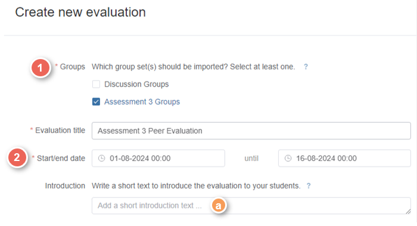 | 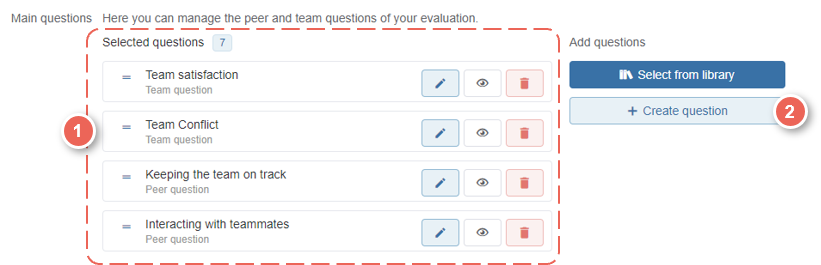 |

| Progreso de la actividad | Reportes por estudiante y grupo |
|:---:|:---:|
| 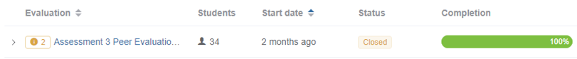 | 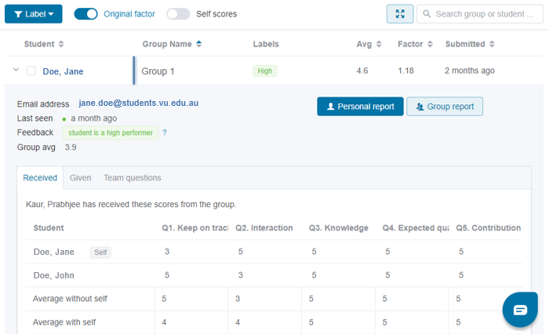 |

> *Fuente: VU Collaborate Help — Victoria University*

---

### 1.2 CATME SMARTER Teamwork

**Descripción general**

CATME (Comprehensive Assessment of Team Member Effectiveness) es una plataforma desarrollada por la Universidad de Purdue con financiamiento de la NSF. Es uno de los sistemas de evaluación entre pares con mayor respaldo académico; sus criterios de evaluación son la base de numerosas investigaciones sobre trabajo colaborativo en ingeniería. Es utilizado en más de 1.000 instituciones de 100 países, incluyendo la Universidad del Norte (Colombia).

**Gestión de grupos**

CATME sí ofrece una herramienta de formación de equipos basada en algoritmos (Team-Maker), pero también permite importar grupos externamente vía CSV. Las actualizaciones son manuales.

**Proceso de evaluación**

Cada estudiante evalúa a sus compañeros usando una rúbrica BARS (Behaviorally Anchored Rating Scale) de 5 niveles con descriptores conductuales concretos. El sistema detecta automáticamente anomalías:
- **Inflador:** da puntuaciones altas a todos para buscar reciprocidad.
- **Castigador:** da puntuaciones bajas sistemáticamente.
- **Clique:** un subgrupo se puntúa mutuamente alto.

**Criterios de evaluación**

Usa el modelo de cuatro criterios con descriptores de nivel que el enunciado del proyecto adopta directamente: la escala "Needs Improvement / Adequate / Good / Excellent" con descriptores conductuales por nivel proviene de este modelo BARS, validado académicamente en *Academy of Management Learning & Education* (2012).

**Visualización de resultados**

- *Profesor:* dashboard con alertas de anomalías, gráficos por equipo, exportación a Excel/CSV.
- *Estudiante:* retroalimentación anonimizada por criterio.

**Limitaciones relevantes**

- Interfaz desactualizada; no hay app móvil.
- Sin integración LTI nativa con Brightspace; importación manual vía CSV.
- La detección de anomalías requiere un umbral mínimo de respuestas.

**Capturas de la interfaz de CATME**

| Tabla de evaluación BARS | Categorías de rating (Contributing) |
|:---:|:---:|
|  | 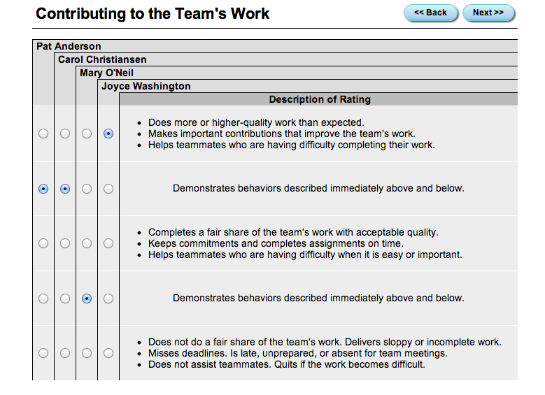 |

| Resultados por estudiante (alertas) | Wizard de configuración de clase |
|:---:|:---:|
|  | 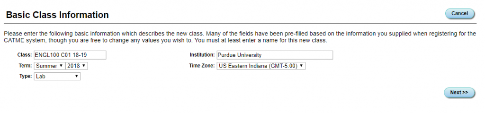 |

> *Fuente: info.catme.org — Purdue University*

---

### 1.3 TEAMMATES (National University of Singapore)

<p align="center">
  
</p>

**Descripción general**

TEAMMATES es una plataforma open-source (GPL-2.0) desarrollada y mantenida por la NUS desde 2010. Ha procesado más de 50 millones de respuestas de más de 200.000 estudiantes en más de 1.100 universidades. Su código fuente es completamente inspectable en GitHub (`TEAMMATES/teammates`). Ganó el Grand Prize en los OSS Awards World Challenge 2014.

**Gestión de grupos**

Los grupos se crean importando estudiantes desde archivos CSV. No tiene integración LMS nativa, pero es fácil de extender por su arquitectura abierta.

**Proceso de evaluación**

1. El instructor crea una "feedback session" con fechas de apertura/cierre.
2. Control granular de visibilidad por pregunta: quién ve el texto de respuesta, quién ve la identidad del evaluador, quién ve la identidad del receptor.
3. Acceso mediante enlace único sin necesidad de crear cuenta.

**Criterios de evaluación**

No impone criterios fijos; el instructor crea preguntas desde cero (MCQ, escala numérica, distribución de puntos entre compañeros, texto libre). La flexibilidad es total pero requiere configuración.

**Visualización de resultados**

- *Instructor:* reportes agrupados por equipo/evaluador/receptor/pregunta, descarga CSV.
- *Estudiante:* retroalimentación recibida con control de anonimato del evaluador.

**Limitaciones relevantes**

- Sin integración LMS nativa ni app móvil.
- Configuración compleja para instructores sin experiencia.
- Sin alertas automáticas sobre patrones de evaluación.

**Capturas de la interfaz de TEAMMATES**

| Vista general | Evaluación entre pares |
|:---:|:---:|
|  |  |

| Control de visibilidad | Reportes y estadísticas |
|:---:|:---:|
|  |  |

| Tipos de preguntas |
|:---:|
|  |

> *Fuente: teammatesv4.appspot.com — National University of Singapore*

---

### Tabla comparativa de referentes

| Característica | Buddycheck | CATME | TEAMMATES |
|---|:---:|:---:|:---:|
| App móvil nativa | ❌ | ❌ | ❌ |
| Integración con Brightspace/LMS | ✅ LTI | ⚠️ CSV manual | ❌ manual |
| Sin autoevaluación por defecto | ✅ | ✅ | Configurable |
| Criterios con descriptores BARS | ⚠️ Flexible | ✅ | ❌ Flexible |
| Visibilidad pública/privada | ✅ | ✅ | ✅ Granular |
| Ventana de tiempo configurable | ✅ | ✅ | ✅ |
| Dashboard promedios multi-nivel | ✅ | ✅ | ✅ |
| Alertas de anomalías | ⚠️ Básico | ✅ 6 tipos | ❌ |
| Open source | ❌ | ❌ | ✅ |
| Disponible en español | ❌ | ❌ | ❌ |
| Costo | 💰 Pago | 💰 Pago | 🆓 Gratuito |

> **Oportunidad identificada:** ninguno de los tres referentes tiene app móvil nativa ni está disponible en español. PeerUn cubre ambas brechas, con integración directa al contexto Uninorte (Roble + Brightspace).

---

## 2. Composición y Diseño de la Solución

### 2.1 Decisión de arquitectura: Una sola app con roles

**Se propone una única aplicación Flutter** que sirve tanto a profesores como a estudiantes, con experiencias de navegación completamente separadas activadas según el rol del usuario autenticado en Roble.

**Alternativas descartadas:**

| Alternativa | Razón de descarte |
|---|---|
| Dos apps separadas | Duplica CI/CD, dos publicaciones en tienda, dos bases de código. Excesivo para el scope del proyecto. |
| Una app con visibilidad condicional (mismas pantallas) | Lógica condicional dispersa en widgets, violando el principio de responsabilidad única. Dificulta mantenimiento. |

**Justificación:**
- Buddycheck y TEAMMATES sirven a ambos roles desde una sola instalación; la separación es a nivel de vista, no de producto.
- Un solo APK reduce fricciones de distribución en clases donde el profesor instala la app junto con sus estudiantes.
- GetX permite definir shells de navegación completamente distintos por rol con `Bindings` por módulo sin cruzar lógica de presentación.

---

### 2.2 Arquitectura técnica (Clean Architecture + GetX)

```
┌────────────────────────────────────────────────────────────────┐
│                         Flutter App                            │
├─────────────────────────┬──────────────────────────────────────┤
│   TeacherShell (GetX)   │         StudentShell (GetX)          │
│  ┌──────┬──────┬──────┐ │  ┌──────────────┬───────────────┐   │
│  │Cursos│Grupos│Stats │ │  │  MisCursos   │ Evaluaciones  │   │
│  └──────┴──────┴──────┘ │  └──────────────┴───────────────┘   │
├─────────────────────────┴──────────────────────────────────────┤
│              Domain Layer (casos de uso — Dart puro)           │
│  AuthUseCase · CourseUseCase · AssessmentUseCase · GroupUseCase│
├────────────────────────────────────────────────────────────────┤
│              Data Layer (repositorios + modelos JSON)          │
│  RobleAuthRepository · RobleDbRepository · LocalCacheRepo      │
├────────────────────────────────────────────────────────────────┤
│                    Infraestructura externa                      │
│          Roble API (auth JWT + DB)    ·    FCM (push)          │
└────────────────────────────────────────────────────────────────┘
```

**Capas:**

| Capa | Responsabilidad | Tecnología |
|---|---|---|
| Presentación | Widgets, controllers GetX, navegación | Flutter + GetX |
| Dominio | Casos de uso, entidades, interfaces de repositorio | Dart puro |
| Datos | Implementación de repositorios, modelos JSON | Roble API + caché local |

- **Estado, navegación e inyección de dependencias:** GetX (`GetxController`, `GetMaterialApp`, `Bindings`)
- **Autenticación y base de datos:** Roble (JWT + Bearer token con refresh automático)
- **Notificaciones push:** Firebase Cloud Messaging (FCM)
- **Permisos en primer lanzamiento:** localización y trabajo en segundo plano

---

### 2.3 Modelo de datos (entidades principales)

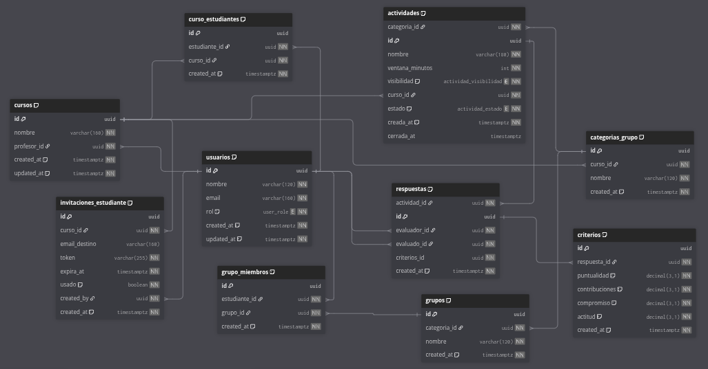

```
Usuario          Curso                  CategoriaGrupo
────────         ─────────────          ──────────────────
id               id                     id
nombre           nombre                 nombre
email            profesorId             cursoId
rol              estudiantesIds[]       grupos[]
(teacher|        categoriasIds[]
 student)

Grupo            Actividad (Evaluación)    Respuesta
────────         ──────────────────────    ──────────────
id               id                        id
nombre           cursoId                   actividadId
categoriaId      categoriaId               evaluadorId
miembrosIds[]    nombre                    evaluadoId
                 ventanaMinutos            criterios {
                 visibilidad                 puntualidad,
                 (publica|privada)           contribuciones,
                 estado                      compromiso,
                 (activa|cerrada)            actitud
                 creadaAt                  }
```

---

## 3. Flujo Funcional Detallado

### 3.1 Flujo del Profesor

```
ONBOARDING
    │
    ▼
[Registro/Login vía Roble]
    │  email + contraseña → JWT devuelve rol = "teacher"
    │  GetX redirige automáticamente a TeacherShell
    ▼
[Crear Curso]
    │  Ingresa nombre del curso → se crea en Roble DB
    ▼
[Invitar Estudiantes]
    │  El sistema genera un enlace mágico (token único, válido 48 h)
    │  El profesor comparte el enlace por email o chat de clase
    │  Cada estudiante que abre el enlace → se registra y une al curso
    ▼
[Importar Grupos desde Brightspace]
    │  El profesor exporta los grupos desde Brightspace (CSV/JSON)
    │  Sube el archivo en la pantalla "Grupos del curso"
    │  La app parsea y crea: categorías de grupo → grupos → miembros
    │  Si los grupos cambian durante el semestre → re-importar
    ▼
[Disparar una Evaluación]
    │  1. Selecciona la categoría de grupo a evaluar
    │  2. Asigna nombre a la actividad
    │  3. Define duración (ej. 30 min, 2 h, 24 h)
    │  4. Elige visibilidad: Pública o Privada
    │  5. Confirma → todos los estudiantes de esa categoría
    │               reciben notificación push automática
    ▼
[Monitorear]
    │  Ve cuántos estudiantes completaron vs. pendientes por grupo
    ▼
[Ver Resultados] — siempre disponibles para el profesor
    │
    ├── Promedio por actividad (todos los grupos del curso)
    ├── Promedio por grupo (entre actividades)
    ├── Promedio por estudiante (entre actividades)
    └── Detalle: grupo → estudiante → puntuación por criterio
```

**Mockups del flujo del profesor:**

| Gestión de cursos | Promedios y analíticas |
|:---:|:---:|
|  | 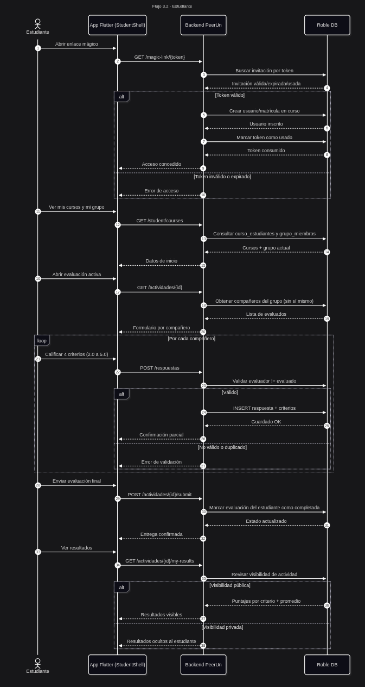 |

---

### 3.2 Flujo del Estudiante

```
ONBOARDING
    │
    ▼
[Abrir enlace mágico]
    │  La app detecta el token, registra al usuario en Roble
    │  y lo une al curso automáticamente
    ▼
[Ver mis cursos y mi grupo]
    │  El estudiante ve en qué grupo está dentro de cada curso
    ▼
[Recibir notificación push]
    │  "Nueva evaluación activa: [nombre] — Tienes [X] horas"
    ▼
[Realizar la evaluación]
    │
    │  Para cada compañero de grupo (sin autoevaluación):
    │  ┌────────────────────────────────────────────────────┐
    │  │  PUNTUALIDAD                                        │
    │  │  ○ 2.0 Needs Improvement                           │
    │  │      "Llegó tarde o faltó en la mayoría..."        │
    │  │  ○ 3.0 Adequate                                    │
    │  │      "Frecuentemente llegó tarde..."               │
    │  │  ○ 4.0 Good                                        │
    │  │      "Generalmente puntual en la mayoría..."       │
    │  │  ● 5.0 Excellent ← descriptor visible en pantalla  │
    │  │      "Consistentemente puntual en todas..."        │
    │  │                                                     │
    │  │  [CONTRIBUCIONES]  [COMPROMISO]  [ACTITUD]         │
    │  └────────────────────────────────────────────────────┘
    │  Navega compañero a compañero → Confirmar al final
    ▼
[Ver resultados propios — solo si evaluación es Pública]
    │  Puntuación recibida por criterio (promedio de pares)
    └── Promedio general del grupo
```

**Mockup del formulario de evaluación:**

<p align="center">
  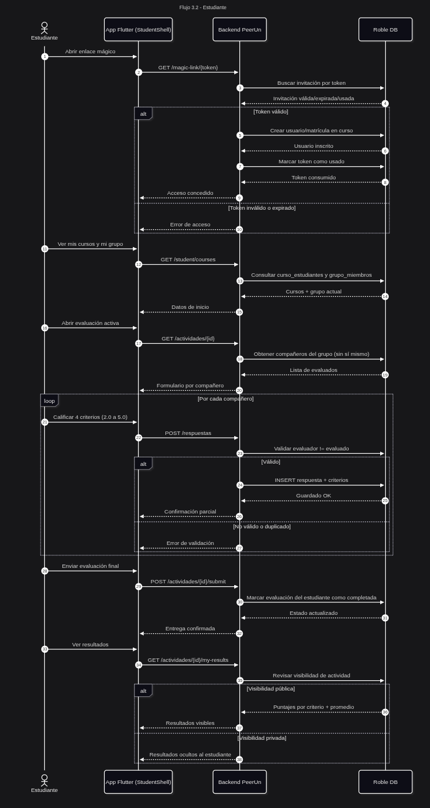
</p>

---

### 3.3 Fórmula de cálculo del puntaje individual

Dado un grupo de $n$ integrantes, el puntaje del estudiante $i$ en la actividad $a$ es:

$$\text{Score}_{i,a} = \frac{1}{n-1} \sum_{\substack{j=1 \\ j \neq i}}^{n} \overline{C}_{j \to i}$$

Donde $\overline{C}_{j \to i}$ es el promedio de los 4 criterios que el evaluador $j$ asignó al evaluado $i$.

El **promedio del estudiante $i$** a través de todas las actividades $A$:

$$\overline{\text{Score}}_i = \frac{1}{|A|} \sum_{a \in A} \text{Score}_{i,a}$$

---

### 3.4 Mapa de navegación (pantallas)

```
Auth
├── /login
├── /register
└── /magic-link/:token     → procesa invitación, redirige al shell correcto

TeacherShell (GetX BottomNav)
├── /teacher/home          → dashboard resumen del profesor
├── /teacher/courses       → lista de cursos creados
│   └── /teacher/courses/:id
│       ├── /groups        → importar / ver categorías y grupos
│       ├── /assessments   → lista de evaluaciones del curso
│       │   └── /:assId/results  → resultados detallados
│       └── /invite        → generar enlace mágico de invitación
└── /teacher/profile

StudentShell
├── /student/home          → mis cursos y evaluaciones activas
├── /student/courses/:id
│   ├── /my-group          → mi equipo y compañeros
│   └── /assessments
│       └── /:assId/evaluate → formulario de evaluación peer-to-peer
└── /student/profile
```

---

## 4. Justificación de la Propuesta

### 4.1 Basada en referentes

**Buddycheck** valida el principio más importante del diseño: los grupos se importan desde el LMS, no se crean en la app. Esto elimina duplicación de datos y el error de transcripción manual. PeerUn replica este patrón adaptándolo a la realidad técnica de Uninorte: importación manual de CSV/JSON en lugar de LTI, dado que no existe integración institucional disponible actualmente.

**CATME** justifica los criterios de evaluación y sus descriptores de nivel. La escala "Needs Improvement 2.0 / Adequate 3.0 / Good 4.0 / Excellent 5.0" con descriptores conductuales es la implementación directa del modelo BARS que CATME popularizó y que tiene respaldo empírico en publicaciones revisadas por pares. La fijación de criterios (en lugar de criterios flexibles como TEAMMATES) reduce la carga cognitiva del profesor, que no necesita diseñar la rúbrica, y garantiza la comparabilidad entre cohortes del mismo curso.

**TEAMMATES** confirma que el control de visibilidad público/privado es una funcionalidad no negociable: los profesores necesitan poder ver resultados sin que los estudiantes los vean (evitar influencias en grupos en conflicto). La opción binaria (pública o privada total) adoptada en PeerUn es más simple y suficiente para el contexto, sin la complejidad granular de TEAMMATES.

**Brecha cubierta por PeerUn:** los tres referentes son aplicaciones web sin app móvil nativa y sin soporte en español. En el contexto colombiano universitario, donde los estudiantes acceden principalmente desde celular, una app Flutter nativa garantiza: notificaciones push para ventanas de evaluación cortas, experiencia offline parcial (ver mi grupo sin red), y UX adaptada a cada rol sin la fricción de un navegador.

---

### 4.2 Basada en entrevistas a docentes *(pendiente — hipótesis a validar)*

> Esta sección se actualizará con los hallazgos de entrevistas a docentes de Uninorte que implementen trabajo colaborativo. Las siguientes hipótesis guían las preguntas diseñadas para esas entrevistas:

| Hipótesis | Pregunta de entrevista |
|---|---|
| Los profesores no tienen un método sistemático actual | "¿Cómo evalúas hoy el desempeño individual de los miembros dentro de cada grupo?" |
| Las evaluaciones se hacen al final del semestre (una sola vez) | "¿Con qué frecuencia evalúas el trabajo en equipo? ¿Al final del sprint, del proyecto o del semestre?" |
| Los estudiantes evitan dar malas notas por miedo a represalias | "¿Has notado que los estudiantes se cuidan de no calificar bajo a sus compañeros? ¿El modo privado de resultados ayudaría?" |
| Los grupos cambian durante el semestre | "¿Con qué frecuencia cambia la composición de los grupos después de formados en Brightspace?" |
| La integración de la nota de evaluación entre pares en la final es un punto de dolor | "¿Cómo incluyes la evaluación entre pares en la nota final? ¿Qué peso le das?" |

---

### 4.3 Tabla resumen de decisiones justificadas

| Decisión de diseño | Justificación |
|---|---|
| Una sola app con roles | Simplicidad de distribución; alineada con práctica estándar de Buddycheck y TEAMMATES |
| Grupos importados (no creados en la app) | Buddycheck demuestra que esta decisión elimina desincronización con el LMS institucional |
| Enlace mágico por email para invitaciones | Método privado y sin contraseña adicional; reduce barrera de entrada para estudiantes |
| Criterios fijos BARS × 4 | Respaldo académico (CATME); coherencia entre evaluaciones; cero configuración para el profesor |
| Visibilidad pública/privada por evaluación | TEAMMATES y Buddycheck demuestran que es un requisito no negociable en contexto educativo |
| Ventana de tiempo configurable | Flexibilidad para diferentes dinámicas pedagógicas (sprint vs. fin de semestre) |
| Sin autoevaluación | Simplifica el formulario y reduce el sesgo de autocomplacencia; diferenciador explícito del enunciado |
---

## 5. Capturas de UI — PeerUn

> Esta sección presenta las pantallas de la aplicación PeerUn organizadas por flujo. Cada placeholder indica qué pantalla debe ir en ese espacio.

### 5.1 Autenticación

| Pantalla | Captura |
|---|:---:|
| **Login** — Formulario de inicio de sesión con email y contraseña (Roble) |  | 
| **Registro** — Formulario de registro de nuevo usuario | 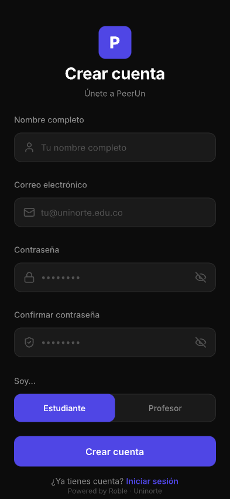 |
| **Magic Link** — Pantalla de procesamiento del enlace mágico de invitación |  |

### 5.2 Flujo del Profesor (TeacherShell)

| Pantalla | Captura |
|---|:---:|
| **Dashboard del Profesor** (`/teacher/home`) — Resumen general: cursos activos, evaluaciones en progreso, estadísticas rápidas |  |
| **Lista de Cursos** (`/teacher/courses`) — Todos los cursos creados por el profesor con acceso rápido | 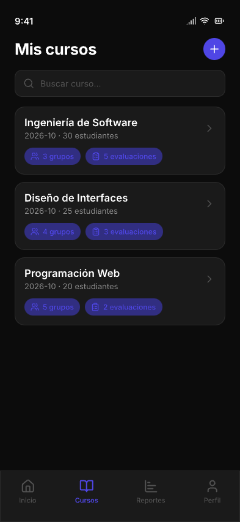 |
| **Detalle del Curso — Grupos** (`/teacher/courses/:id/groups`) — Importar CSV/JSON de Brightspace, ver categorías y grupos con sus miembros |  |
| **Detalle del Curso — Evaluaciones** (`/teacher/courses/:id/assessments`) — Lista de evaluaciones del curso con estado (activa/cerrada) y progreso | 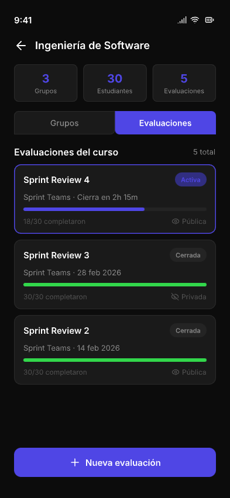 |
| **Crear/Disparar Evaluación** — Modal o pantalla para configurar nueva evaluación: nombre, categoría, duración, visibilidad | 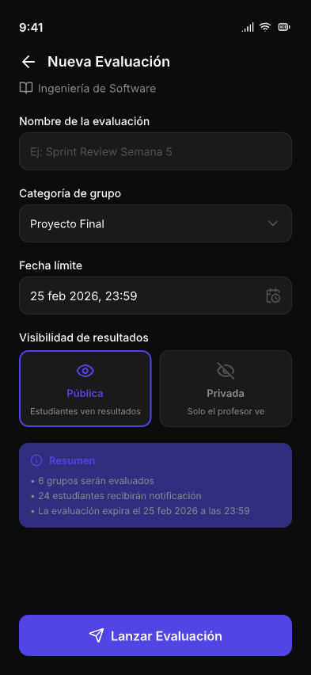 |
| **Resultados de Evaluación** (`/teacher/courses/:id/assessments/:assId/results`) — Dashboard de resultados: promedios por grupo, por estudiante, detalle por criterio | 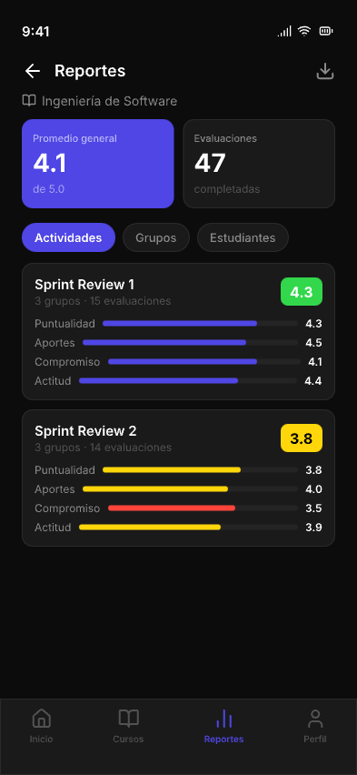 |
| **Generar Enlace de Invitación** (`/teacher/courses/:id/invite`) — Pantalla para generar y compartir el enlace mágico del curso |  |
| **Perfil del Profesor** (`/teacher/profile`) — Información personal, configuraciones de cuenta | 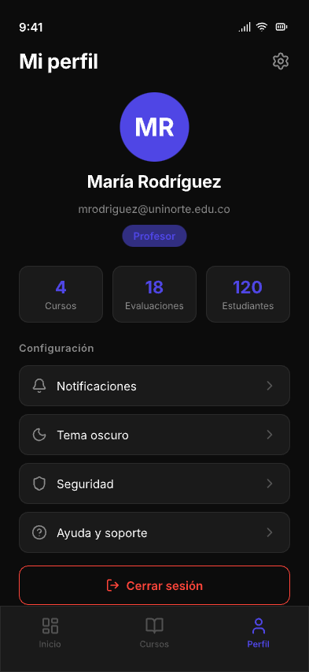 |

### 5.3 Flujo del Estudiante (StudentShell)

| Pantalla | Captura |
|---|:---:|
| **Home del Estudiante** (`/student/home`) — Mis cursos y evaluaciones activas pendientes con countdown | 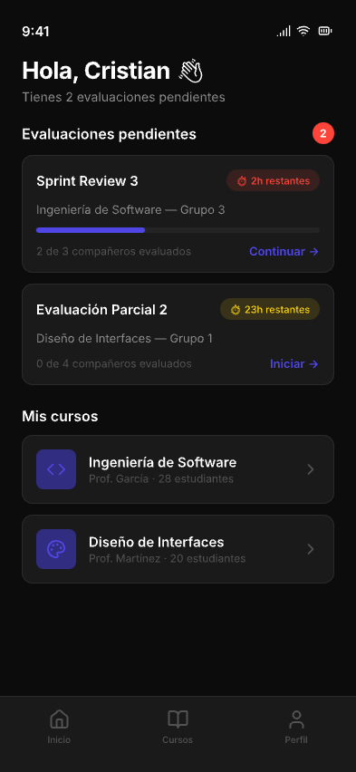 |
| **Mi Grupo** (`/student/courses/:id/my-group`) — Ver equipo asignado y compañeros dentro del curso |  |
| **Formulario de Evaluación** (`/student/courses/:id/assessments/:assId/evaluate`) — Evaluación peer-to-peer: 4 criterios BARS por cada compañero, navegación entre compañeros |  |
| **Resultados Propios** (solo en evaluaciones públicas) — Puntuación recibida por criterio y promedio general del grupo |  |
| **Perfil del Estudiante** (`/student/profile`) — Información personal del estudiante |  |
---

*Propuesta elaborada por Cristian — Febrero 2026*
