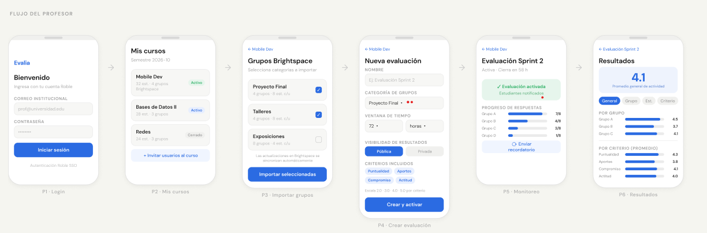
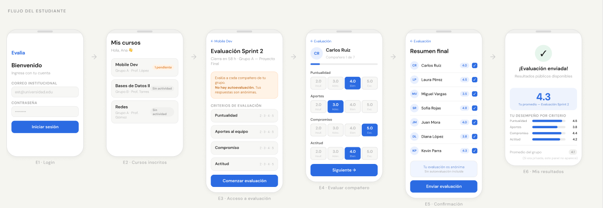

# 📱 Evalia -- Propuesta de solución
| **Estudiante** | Sandro Torres |
|---------------|------------------|
| **Proyecto**  | Aplicación móvil de evaluación entre pares |
| **Fecha**     | 25 de febrero de 2026 |

---

## Introducción

Evalia es una aplicación móvil diseñada para facilitar y optimizar los procesos de evaluación entre pares en actividades colaborativas académicas. La plataforma permite a docentes activar evaluaciones estructuradas por criterios y a los estudiantes valorar el desempeño de sus compañeros de manera organizada, clara y objetiva.

La propuesta se enfoca en ofrecer una experiencia minimalista y fácil de usar, priorizando la claridad en la interacción y la visualización de resultados. A diferencia de los sistemas tradicionales integrados en plataformas LMS, Evalia busca mejorar la experiencia móvil mediante una interfaz simplificada y una estructura funcional centrada exclusivamente en el proceso de evaluación colaborativa.

---

## Referentes Analizados

### 1️⃣ Peergrade

#### Descripción

Peergrade es una plataforma especializada en evaluación entre pares en contextos educativos formales. Permite a los estudiantes evaluar el trabajo de sus compañeros mediante rúbricas estructuradas definidas por el docente. El sistema asigna evaluadores automáticamente y gestiona la entrega, revisión y publicación de resultados dentro de un flujo claramente definido.

Está orientada principalmente a educación superior y se integra con diversos LMS mediante estándar LTI.

#### Aportes relevantes al proyecto

- Evaluación estructurada basada en criterios.
- Asignación automática de evaluaciones.
- Configuración de anonimato entre evaluadores.
- Promedios automáticos por criterio.
- Integración con LMS institucionales.

#### Limitaciones 

- Interfaz más optimizada para escritorio que para móvil.
- Flujo de evaluación con múltiples pasos que puede resultar extenso.
- Visualización de resultados poco simplificada.
- Modelo de licencia institucional paga.

#### Incidencia en Evalia

Evalia adopta la estructura formal de rúbricas y la asignación automática de evaluaciones, pero propone una experiencia mobile-first simplificada, concentrando la evaluación en una sola vista clara y reduciendo fricción en el proceso.

---

### 2️⃣ FeedbackFruits (Peer Review Module)

#### Descripción

FeedbackFruits es una plataforma de aprendizaje colaborativo que incluye un módulo especializado en evaluación entre pares. Está diseñada para integrarse profundamente con LMS institucionales y ofrece herramientas avanzadas de seguimiento de participación, calidad del feedback y métricas de interacción.

Su enfoque es robusto y analíticamente detallado, orientado a instituciones que buscan trazabilidad avanzada en procesos evaluativos.

#### Aportes relevantes al proyecto

- Métricas detalladas de participación.
- Seguimiento de calidad del feedback.
- Comparación entre autoevaluación y evaluación de pares.
- Integración fuerte con LMS como Brightspace.
- Paneles analíticos para docentes.

#### Limitaciones 

- Complejidad alta en configuración.
- Interfaz visualmente densa.
- Sobrecarga de métricas que puede dificultar interpretación rápida.
- Solución completamente institucional y de alto costo.

#### Incidencia en Evalia

Evalia retoma la idea de incorporar métricas comparativas y visualización de resultados, pero propone un enfoque minimalista, priorizando indicadores claros y comprensibles en pantalla móvil, evitando la saturación informativa.

---

### 3️⃣ Eduflow

#### Descripción

Eduflow es una plataforma digital orientada al aprendizaje activo que integra evaluación entre pares dentro de flujos de trabajo estructurados. Permite la creación de actividades colaborativas donde los estudiantes entregan trabajos, evalúan a otros participantes y reciben retroalimentación de manera organizada y progresiva.

Se caracteriza por una interfaz moderna y una experiencia de usuario más visual y simplificada en comparación con otras plataformas tradicionales.

#### Aportes relevantes al proyecto

- Flujo progresivo claro (entrega → evaluación → resultados).
- Interfaz limpia y visualmente ordenada.
- Integración con LMS mediante LTI.
- Gestión estructurada de rúbricas.
- Experiencia más intuitiva para estudiantes.

#### Limitaciones 

- Orientación más amplia hacia aprendizaje activo general, no exclusivamente peer assessment.
- Enfoque principalmente web.
- Licencia institucional paga.
- Métricas colaborativas menos profundas que otras soluciones más técnicas.

#### Incidencia en Evalia

Evalia adopta de Eduflow el enfoque visual minimalista y el flujo progresivo claramente segmentado, pero lo adapta específicamente al contexto de evaluación entre pares universitaria, optimizando la experiencia para dispositivos móviles y simplificando aún más la interacción.

---

### 🧩 Análisis Comparativo y Posicionamiento

El análisis de los referentes demuestra que las soluciones actuales priorizan robustez institucional, integración con LMS y modelos evaluativos estructurados. Sin embargo, presentan en común una experiencia poco optimizada para entornos móviles y una tendencia hacia interfaces densas y complejas.

Evalia se posiciona como una propuesta que:

- Mantiene la estructura formal de rúbricas.
- Integra métricas comparativas relevantes.
- Reduce complejidad visual y operativa.
- Prioriza experiencia móvil minimalista.
- Se orienta específicamente al contexto universitario con integración a Brightspace.

De esta manera, la propuesta no compite en robustez institucional avanzada, sino en claridad, accesibilidad y experiencia de usuario.

---

## Arquitectura

## 🏗️ Composición y Diseño de la Solución

### 🧭 Decisión de Configuración General del Sistema

Para el diseño de Evalia se analizaron distintas configuraciones posibles, como el desarrollo de aplicaciones independientes para docentes y estudiantes. Sin embargo, se optó por una única aplicación móvil con diferenciación por roles, gestionada mediante autenticación institucional y control de permisos. Esta decisión responde a la necesidad de mantener una experiencia unificada, reducir complejidad técnica y evitar duplicación de lógica e infraestructura. Además, en el contexto universitario es común que un mismo usuario pueda desempeñar distintos roles académicos, por lo que una solución integrada resulta más coherente y flexible. Desde el enfoque minimalista que queremos seguir tanto para el diseño visual como para la modularización de la arquitectura, fragmentar la aplicación habría incrementado fricción y mantenimiento innecesario, mientras que una arquitectura unificada permite escalabilidad, coherencia visual y mayor facilidad de adopción institucional.

### Enfoque Arquitectónico General

Evalia se diseña bajo **Clean Architecture**, separando claramente responsabilidades en distintas capas, garantizando independencia de la interfaz de usuario, independencia del framework, independencia de la base de datos, alta testabilidad y escalabilidad futura.

La aplicación se concibe como una solución *mobile-first*, estructurada en arquitectura cliente-servidor, con integración a Brightspace como LMS para la obtencion de los grupos correspondientes a cada curso, de los cuales los profesores podrán crear evaluaciones para los estudiantes.

---

## 🧱 Arquitectura en Capas (Clean Architecture)

La aplicación se divide en cuatro capas principales:

### 1️⃣ Capa de Presentación (Presentation Layer)

Responsable de la interfaz móvil.

- Pantallas (Cursos, Actividades, Evaluación, Resultados).
- Gestión de estado.
- Navegación.
- Validaciones básicas de entrada.

Esta capa no contiene lógica de negocio, únicamente se comunica con los casos de uso.

---

### 2️⃣ Capa de Aplicación (Use Cases / Application Layer)

Contiene la lógica de negocio específica del sistema:

- Crear actividad de evaluación.
- Asignar evaluadores automáticamente.
- Calcular promedios por criterio.
- Calcular métricas colaborativas.
- Determinar visibilidad de resultados.

Los casos de uso son independientes del framework móvil y de la base de datos.

---

### 3️⃣ Capa de Dominio (Domain Layer)

Núcleo del sistema.

Incluye:

- Entidades principales (Usuario, Curso, grupo, Rúbrica, Evaluación).
- Reglas de negocio puras.
- Modelos independientes de infraestructura.
- Interfaces de repositorios.

Esta capa no depende de ninguna otra.

---

### 4️⃣ Capa de Infraestructura (Infrastructure Layer)

Encargada de:

- Implementación de repositorios.
- Conexión a base de datos.
- Integración con Brightspace (API o LTI, no sé cuál sea el medio por el que se puede hacer esto con BS, así que ambas opciones estan especificadas, una cosa que es posible justamente gracias a clean arch ya que se podrían incluso hacer ambas implementaciones sin afectar la lógica de negocio).
- Autenticación institucional.
- Servicios externos.

Aquí se implementan los detalles técnicos sin afectar la lógica central.

---

## 👥 Gestión de Roles

Se propone una única aplicación con diferenciación por rol (Docente / Estudiante).

La separación se realiza mediante:

- Control de acceso basado en rol.
- Autorización gestionada desde el backend (nutriendose de las capacidades de la plataforma "roble").
- Interfaces dinámicas según permisos.

Esta decisión reduce mantenimiento y asegura coherencia visual.

---

## 🗄️ Modelo de Datos Conceptual

Entidades principales:

- Usuario
- Curso
- Grupo
- Actividad
- Rúbrica
- Criterio
- Evaluación
- Resultado

Las relaciones siguen principios de bajo acoplamiento y alta cohesión.

---

---

## 🔄 Flujo Funcional

### 👩‍🏫 Flujo del Profesor

#### P1 — Inicio de Sesión

El docente accede mediante autenticación institucional (mediante Roble).  
El sistema valida credenciales y carga automáticamente los cursos asociados desde Brightspace.

---

#### P2 — Mis Cursos

Se muestran los cursos activos en formato de tarjetas con:

- Nombre del curso
- Número de grupos
- Estado (Activo / Cerrado)

El docente selecciona el curso en el que desea crear o gestionar una evaluación.

---

####  P3 — Importación de Grupos (Brightspace)

Desde el curso seleccionado, el docente visualiza los grupos existentes en Brightspace.

Puede:

- Seleccionar uno o varios grupos
- Importarlos a Evalia
- Confirmar sincronización

Este paso evita la creación manual de grupos y mantiene un orden y cohesion con el resto de herramientas utilizadas por la universidad

---

#### P4 — Crear Evaluación

El docente configura la nueva evaluación de compañeros para un grupo:

- Nombre de la evaluación
- Categoría de grupo
- Ventana de tiempo (horas)
- Visibilidad de resultados (Pública / Privada)
- Criterios incluidos (originalmente está planeado que sean fijos basado en lo expuesto en el documento pero ante la duda dejamos abierta la posibilidad de que sean escogidos)
- Escala de calificación (también en caso de que no se use exclusivamente la escala expuesta en las especificaciones iniciales del programa)

Al finalizar, presiona **"Crear y activar"**, lo que:

- Registra la actividad
- Inicia la ventana evaluativa
- Notifica a los estudiantes

---

#### P5 — Monitoreo de Evaluación

Durante el período activo, el docente puede visualizar:

- Estado: Evaluación activada
- Progreso de respuestas por grupo
- Número de evaluaciones completadas
- Opción de enviar recordatorios

Esta pantalla funciona como panel de control en tiempo real.

---

#### P6 — Resultados y Analítica

Al cerrar la evaluación, el sistema:

- Calcula promedios por estudiante
- Calcula promedio general de la actividad
- Desglosa resultados por grupo
- Presenta promedio por criterio

---

### 👩‍🎓 Flujo del Estudiante

#### E1 — Inicio de Sesión

El estudiante accede mediante autenticación institucional.

---

#### E2 — Cursos Inscritos

Se muestran los cursos en los que participa, con indicador de estado:

- Pendiente
- Sin actividad
- Evaluación activa

Selecciona el curso correspondiente.

---

#### E3 — Acceso a Evaluación

El estudiante visualiza:

- Nombre de la actividad
- Fecha de cierre
- Estado del grupo
- Criterios de evaluación

Al presionar **"Comenzar evaluación"**, inicia el proceso.

---

#### E4 — Evaluar Compañero

Pantalla principal de evaluación:

- Nombre del compañero
- Barra de progreso
- Criterios con escala numérica (2.0 – 5.0)
- Botón "Siguiente"

La evaluación se realiza en una vista clara y estructurada para minimizar distracciones.

---

#### E5 — Confirmación Final

Se muestra un resumen de:

- Compañeros evaluados
- Calificaciones asignadas

El estudiante confirma y envía la evaluación, la cuál una vez enviada no puede editarse.

---

#### E6 — Visualización de Resultados

En caso de ser una evaluación de visualización pública de resultados, el estudiante puede consultar:

- Promedio individual recibido
- Desempeño por criterio
- Comparación con promedio del grupo
- Indicadores visuales de rendimiento

---

## Justificación de la Propuesta

La propuesta de Evalia surge a partir del análisis de plataformas existentes de evaluación entre pares y de la reflexión sobre problemáticas reales observadas en el contexto académico universitario. Para fortalecer la fundamentación de la solución, se tomó como referencia la experiencia del profesor Daniel Romero, con quien he trabajado como monitor académico en la asignatura de estructuras de datos I, la cuál incluye proyectos colaborativos, así como las otras asignaturas que el profesor dicta y las cuáles yo mismo he cursado con él.

Durante esta experiencia fue posible rememorar múltiples situaciones en las que surgían dificultades asociadas al trabajo en equipo, especialmente en etapas finales de los proyectos. Con el fin de profundizar en esta problemática, se planteó la siguiente pregunta:

**¿Qué ocurre usualmente con respecto a los equipos de trabajo en los proyectos de las asignaturas que usted dicta?**

El profesor explicó que con frecuencia los estudiantes manifiestan inconformidades sobre el bajo aporte de algún integrante únicamente cuando el proyecto ya ha sido entregado y evaluado. En muchos casos, la queja aparece después de recibir una calificación baja, momento en el cual los plazos institucionales para modificación de notas ya se encuentran próximos a cerrar o hacen difícil intervenir oportunamente. Según su experiencia, esta situación es constante a lo largo de los semestres y genera frustración tanto en estudiantes como en el docente, quien carece de herramientas formales para monitorear la dinámica interna de los equipos durante el proceso.

A partir de esta conversación surgió una segunda pregunta clave:

**¿Cuenta actualmente con algún mecanismo estructurado que le permita detectar de manera anticipada desequilibrios en la participación dentro de los equipos?**

La respuesta evidenció que, aunque existen espacios informales de retroalimentación, no se dispone de una herramienta sistemática que permita obtener métricas objetivas y periódicas sobre el desempeño individual dentro del grupo antes de la entrega final.

Este escenario justifica la necesidad de una aplicación como Evalia, que permita activar evaluaciones estructuradas en momentos estratégicos del proyecto (por ejemplo, hitos intermedios), generando métricas claras sobre puntualidad, compromiso, aportes y actitud. De esta manera, el docente podría identificar patrones de bajo desempeño con anticipación y tomar decisiones pedagógicas oportunas, reduciendo conflictos posteriores y mejorando la equidad en la evaluación.

La elección del profesor Daniel Romero como referente para esta justificación no es casual. Al haber sido su monitor académico, fue posible observar de primera mano la recurrencia de esta problemática y comprender su impacto en la dinámica de los cursos. Esto permitió fundamentar la propuesta no solo desde el análisis teórico de plataformas existentes, sino desde una necesidad práctica y reiterada en el contexto real.

En consecuencia, Evalia no se plantea únicamente como una herramienta tecnológica, sino como un mecanismo de prevención y acompañamiento en procesos colaborativos, orientado a generar transparencia, trazabilidad y retroalimentación estructurada dentro del trabajo en equipo universitario.

##Vistas y enlace a Figma:

Link a figma:https://www.figma.com/design/Fg6gFmRqxWChHEaiA3MCE9/Figma---del-proyecto?node-id=1-3427&t=EbLa5K9wPBL1S0ev-1
